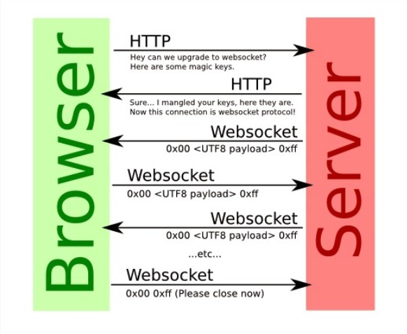
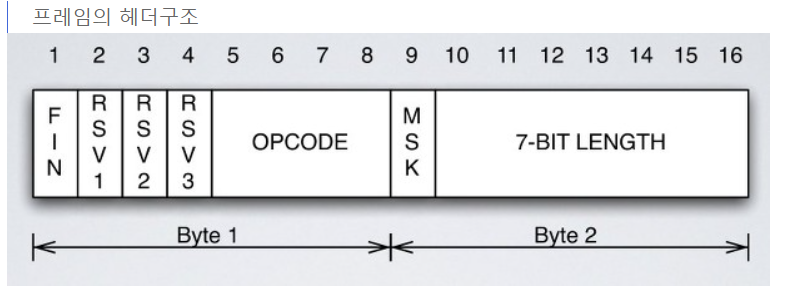

# 웹 소켓 동작 방법



웹 소켓은 전이중 통신이므로, 연속적인 데이터 전송의 신뢰성을 보장하기 위해 Handshake 과정을 진행한다.

기존의 다른 TCP 기반의 프로토콜은 TCP layer에서의 Handshake를 통해 연결을 수립하는 반면, 웹 소켓은 HTTP 요청 기반으로 Handshake 과정을 거쳐 연결을 수립한다.

웹 소켓은 연결을 수립하기 위해 `Upgrade 헤더`와 `Connection 헤더`를 포함하는 HTTP 요청을 보낸다.


> 요청(Request) - http(80) or https(443)

```json
GET /chat HTTP/1.1
Host: example.com:8000
Upgrade: websocket
Connection: Upgrade
Sec-WebSocket-Key: dGhlIHNhbXBsZSBub25jZQ==
Origin: http://example.com
Sec-WebSocket-Protocol: chat, superchat
Sec-WebSocket-Version: 13
```


- `GET /chat HTTP/1.1` : 반드시 **GET** 방식으로만 요청해야한다. HTTP는 1.1 이상이어야한다.
- `Host: example.com:8000` : 웹 소켓 서버의 주소
- `Upgrade: websocket` : 현재 클라이언트, 서버, 전송 프로토콜 연결에서 다른 프로토콜로 업그레이드 또는 변경하기 위한 규칙
- `Connection: Upgrade` : 송신자는 반드시 Upgrade 옵션을 지정한 Connection 헤더 필드가 필요하다.
- `Sec-WebSocket-Key: dGhlIHNhbXBsZSBub25jZQ==` : 클라이언트와 서버 간 서로의 신원을 인증한다.
- `Origin: <http://example.com`> : 클라이언트의 주소
- `Sec-WebSocket-Protocol: chat, superchat` : 여러 서브 프로토콜을 의미한다. 이 중에서 서버가 지원하는 프로토콜을 다시 반환한다.


> 응답(Response) - http(80) or https(443)

````json
HTTP/1.1 101 Switching Protocols
Upgrade: websocket
Connection: Upgrade
Sec-WebSocket-Accept: s3pPLMBiTxaQ9kYGzzhZRbK+xOo=
````

- `101 Switching Protocols` : 101 Switching Protocols가 응답으로 오면 웹 소켓이 연결되었다는 의미이다.

- `Sec-WebSocket-Accept: s3pPLMBiTxaQ9kYGzzhZRbK+xOo=`

  - 클라이언트로 부터 받은 Sec-WebSocket-Key를 사용하여 계산된 값으로 서로의 신원을 인증하는 과정에 필요한 헤더
  - 클라이언트에서 계산한 값과 일치하지 않으면 연결하지 않는다.

  

> HTTP를 이용해 Hand Shaking이 완료되었으므로, 이제 프로토콜이 WS로 변경된다.
> 지금부터는 HTTP 라고 하지 않는다. 그리고 이 순간부터 양방향 통신이 가능해진다

- `ws(80) or wss(443)` 으로 통신한다. `wss`란 https 처럼 ws 프로토콜에 데이터 보안을 위해 SSL을 적용한 프로토콜이다.

- `Message` : 여러 Frame이모여서 구성하는 하나의 논리적 메시지 단위. ws 프로토콜을 통해 주고 받는 단위라고 보면된다.

- `Frame` : Communication에서 가장 작은 단위의 데이터 (`작은 헤더 + Payload` 로 구성) -> 기존 무거운 헤더의 단점을 보완

- 웹 소켓 통신에 사용되는 데이터는 UTF-8 인코딩을 통해서만 지원된다.

- `0x00{보내고 싶은 데이터}0xff` 와 같은 형태로 데이터를 주고 받는다.

  

## cf) 프레임 더 알아보기



- `FIN (END)` : 이 프레임이 전체 메시지의 끝인지 나타내는 플래그
- `OPCODE`
  - **Continue (0x0)** : 전체 메시지의 일부임을 의미
  - **Text (0x1)** : 포함된 데이터가 UTF-8 텍스트라는 의미
  - **Binary (0x2)** : 포함된 데이터가 이진 데이터라는 의미
  - **close (0x8)** : Close 핸드쉐이크를 시작한다는 의미
- `Length` : 이 프레임에 포함된 데이터의 총 길이를 나타내는 단위
- `RSV 1~3` : 프로토콜 별로 사용할 수도 있고 사용할 수도 있지 않은 것들이다.

핸드 쉐이크도 완료되었고, 이로인한 데이터 양방향 전송도 모두 완료 되었다면 이제는 연결 종료해야 한다.

연결 종료 할 때는 Close Frame을 주고 받으며 종료한다.

# 웹 소켓 프로토콜의 특징

- 최초 접속시에만 http프로토콜 위에서 handshaking을 하기 때문에 http header를 사용한다
- 웹소켓을 위한 별도의 포트는 없고, 기존 포트를 사용한다
- 프레임으로 구성된 메시지라는 논리적 단위로 송수신 한다
- 메시지에 포함될 수 있는 교환 가능한 메시지는 텍스트와 바이너리 뿐이다

# 웹소켓 한계극복

> 웹 소켓은 HTML5 이후에 나왔기 때문에, HTML5 이전의 기술에는 적용이 어렵다.

- 이때는 `Socket.io와 SockJS`라는 것을 이용해서 HTML5 이전 기술로 구현된 서비스에서도 웹 소켓처럼 사용할 수 있다.
- Javascript를 이용하여 브라우저 종류에 상관없이 실시간 웹을 구현한다.
- **브라우저와 웹 서버의 종류와 버전을 파악하여 가장 적합한 기술을 선택하여 사용하는 방식이다.**


> 웹 소켓은 문자열들을 주고 받을 수 있게 해줄 뿐 그 이상의 일은 하지 않는다.

- 즉 주고 받은 문자열의 해독은 온전히 애플리케이션에만 맡긴다.

- HTTP는 형식이 있으므로 애플리케이션에서 해석이 쉽지만, WS는 형식이 정해져 있지 않아서 해석하기 어렵다.

- 따라서 WS 방식은 Sub Protocol을 사용해서 주고 받는 메시지의 형태를 약속하는 경우가 많다.

- 이러한 Sub Protocol 중 하나가 `STOMP(Simple Text Oriented Message Protocol)` 이다.

  

## stomp(Simple Text Oriented Message Protocol) 간단 알아보기

### Stomp(Simple Text Oriented Message Protocol)

```
메시지 전송을 효율적으로 하기 위한 프로토콜

웹소켓 위에 얹어 함께 사용할 수 있음

PUB / SUB 구조로 되어있음

클라이언트와 서버가 전송할 메세지의 유형, 형식, 내용들을 정의하는 매커니즘

메세지의 헤더에 값을 줘서 인증 처리를 구현하는 것도 가능
```

### PUB / SUB

```
메시지를 공급하는 주체와 소비하는 주체를 분리해 제공하는 메세징 방법

채팅방 생성 - 우체통(Topic)
채팅방에 글을 씀 - 집배원(Pub)
채팅방에 들어감 - 구독자(Sub)
```

### Message Broker

```
발신자의 메세지를 받아와서 수신자들에게 메세지를 전달하는 어떤 것

Spring에서 지원하는 STOMP를 사용하면 Simple In-Memory Broker를 이용

RabbitMQ, ActiveMQ같은 외부 메세징 시스템을 STOMP Broker로 사용할 수 있도록 지원

스프링은 메세지를 외부 Broker에게 전달하고, Broker는 WebSocket으로 연결된 클라이언트에게 메세지를 전달
```

### 프레임 구조

```json
웹소켓과 다르게 보내는 형식이 정해져있음

COMMAND          (SEND(메세지 전송)/SUBSCRIBE(메세지 구독))
header1:value1 : 어디로 보낼지 destination이 됨
header2:value2

Body^@ : payload
예시

<ClientA가 5번채팅방에 대해 구독>

SUBSCRIBE
destination: /topic/chat/room/5
id: sub-1

^@
    
<ClientB에서 채팅메세지 보냄>

SEND
destination: /pub/chat
content-type: application/json

{"chatRoomId": 5, "type": "MESSAGE", "writer": "clientB"} ^@

<받은 메세지를 모든 구독자에게 보냄>

MESSAGE
destination: /topic/chat/room/5
message-id: d4c0d7f6-1
subscription: sub-1


{"chatRoomId": 5, "type": "MESSAGE", "writer": "clientB"} ^@
```

### Pub/Sub 메시징 흐름

[](https://camo.githubusercontent.com/623847b82a4fb477778362dc3e24eb805d0dd442f9b818f3fee255356b620a20/68747470733a2f2f696d616765732e76656c6f672e696f2f696d616765732f7261696e626f777765622f706f73742f31356661616230362d656466312d346132312d626438652d6330383164396135656562382f696d6167652e706e67)

SEND : 발신자. 구독자에게 메세지를 보내고 싶어함.

```
1. 클라이언트에서 메세지를 보내면 일단 먼저 @MessageMapping이 붙은 Controller가 받는다.
2. /topic을 destination 헤더로 넣어서 메세지를 바로 송신할 수 도 있고
3. /app을 destination 헤더로 넣어서 서버 내에서 가공을 줄 수 있음
4. 서버가 가공을 완료했으면, 메시지를 /topic이란 경로를 담아서 다시 전송하면
5. SimpleBroker에게 전달되고
6. simpleBroker는 전달받은 메세지를 구독자들에게 최종적으로 전달하게 됨.
```

MESSAGE : 구독. /topic이란 경로를 구독중


## stomp 추가 설명 밑에 링크 확인하기! 


----

참고 

1.  BE용 STOMP https://www.youtube.com/watch?v=rvss-_t6gzg 

2.  https://www.youtube.com/watch?v=MPQHvwPxDUw&t=243s

3.  https://tecoble.techcourse.co.kr/post/2021-08-14-web-socket/

4.  https://kyleyj.tistory.com/59

5. stomp 자세히 알아보기 https://dev-gorany.tistory.com/235 

6. FE용 stomp.js 공식문서 : https://stomp-js.github.io/ 

7. https://github.com/namusik/TIL-SampleProject/blob/main/websocket/2)%20stomp%20%EA%B0%9C%EB%85%90.md

   