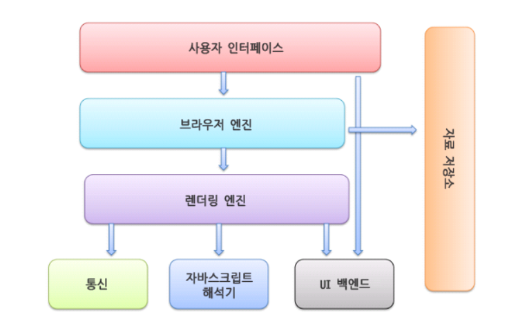
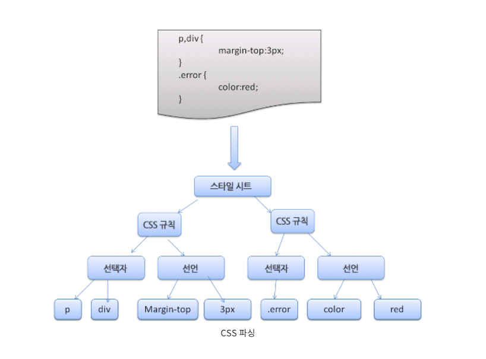
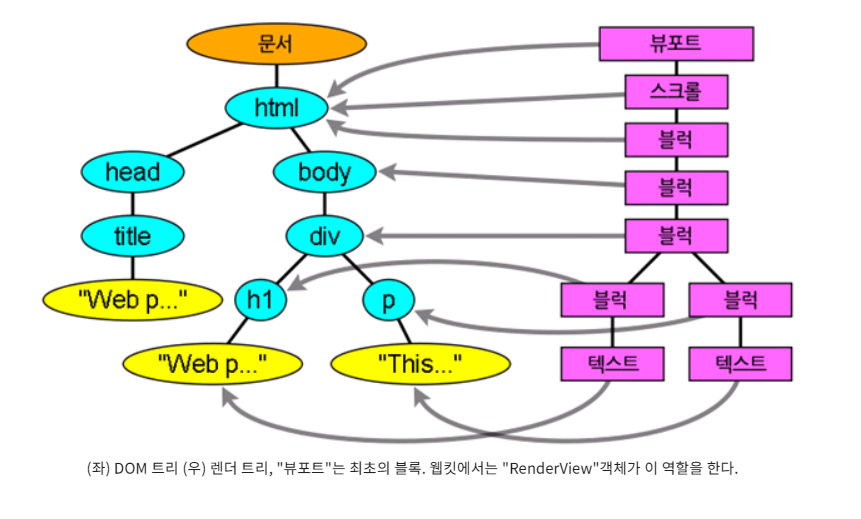

# 웹 브라우저 동작 원리 


## 1. 브라우저란?!

>  **웹 브라우저는 동기(Synchronous)적으로 (HTML + CSS), Javascript 언어를 해석하여 내용을 화면에 보여주는 응용 소프트웨어입니다.**


### 웹 브라우저가 동기적이기 때문에 발생하는 일

=> `script` 태그를 body 태그 하단에 위치 시킨다.

- HTML 요소들이 script 로딩 지연으로 인해 렌더링에 지장 받는 일이 발생하지 않아 페이지 로딩 시간이 단축된다.

- DOM이 완성되기 전에 script가 DOM을 조작한다면 에러가 발생한다. 

- 자바스크립트는 렌더링 엔진이 아닌 자바스크립트 엔진이 처리한다.


## 2. 브라우저 기본 구조




1. ### 사용자 인터페이스 

   - 사용자가 접근할 수 있는 영역. 주소 표시줄, 이전/다음 버튼, 북마크 메뉴 등. 요청한 페이지를 보여주는 창을 제외한 나머지 모든 부분

   

2. ### 브라우저 엔진

   - 사용자 인터페이스와 렌더링 엔진 사이의 동작을 제어

     

3. ### <u>***렌더링 엔진***</u> 

   - 웹 서버로부터 응답 받은 자원을 웹 브라우저 상에 나타냄. 예를 들어 HTML을 요청하면 HTML과 CSS를 파싱하여 화면에 표시함.

   >  **렌더링 엔진은 HTML, XML, 이미지 등 요청받은 내용을 브라우저 화면에 표시하는 엔진**

   

   * 각 브라우저마다 렌더링 엔진이 다르기 때문에 같은 페이지가 다르게 보이는 경우가 있음.

   EX) 인터넷 도구 Elments 탭에서 확인 

   ```html
   -moz-border-radius: 1em; // 파이어폭스 브라우저에 적용
   -ms-border-radius: 2em; // 익스플로어에 적용, 보통 생략
   -o-border-radius: 3em; // 오페라에 적용
   -webkit-border-radius: 4em; // 구글, 사파리 브라우저에 적용
   ```

   

4. ### 통신 

   - HTTP 요청과 같은 네트워크 호출에 사용됨. 이것은 플랫폼 독립적인 인터페이스이고 각 플랫폼 하부에서 실행됨.

   

5. ### UI 백엔드  

   - 콤보 박스와 창 같은 기본적인 장치를 그림. 플랫폼에서 명시하지 않은 일반적인 인터페이스로서, OS 사용자 인터페이스 체계를 사용.

     (ex) select, input

   

6. ### 자바스크립트 해석기 

   - 자바스크립트 코드를 해석하고 실행.

   

7. ### 자료 저장소 

   * Cookie, Local Storage, Indexed DB 등 브라우저 메모리를 활용하여 저장하는 영역


## 3. 브라우저의 렌더링 과정


**위의 그림은 브라우저의 렌더링 과정을 도식화 한것이다. 이를 간단히 순서대로 설명해보면 다음과 같다.** 


1. 브라우저는 HTML, CSS, 자바스크립트, 이미지, 폰트 파일 등 렌더링에 필요한 리소스를 요청하고 서버로부터 응답을 받는다
2. 브라우저의 렌더링 엔진은 서버로부터 응답된 HTML과 CSS를 파싱하여 DOM과 CSSOM을 생성하고 이들을 결합하여 렌더 트리를 생성한다.
3. 브라우저의 자바스크립트 엔진(v8)은 서버로부터 응답된 자바스크립트를 파싱하여 AST를 생성하고 바이트코드로 변환하여 실행한다. 이때 자바스크립트는 DOM API를 통해 DOM이나 CSSOM을 변경할 수 있다. 변경된 DOM과 CSSOM은 다시 렌더 트리로 결합된다.
4. 렌더 트리를 기반으로 HTML 요소의 레이아웃(위치와 크기)을 계산하고 브라우저 화면에 HTML 요소를 페인팅한다.


### HTML파싱과 DOM생성

인터넷 주소를 치면 그 사이트에 알맞는 index.html 파일을 가져오게 된다. 브라우저 렌더링 엔진은 HTML 문서를 파싱하여 브라우저가 이해할 수 있는 자료구조인 `DOM`을 생성하는데 자세한 과정은 다음과 같다.

1. 문자열로 변환된 HTML 문서를 읽고 이를 문법적 의미를 갖는 코드의 최소 단위인 토큰들로 분해한다.
2. 이 토큰들은 다시 객체로 변환하여 노드들을 생성한다. 또한 이 노드들은 트리의 자료구조로 요소 간의 관계를 나타내는데 이러한 노드의 트리 자료구조를 DOM이라고 한다.

**EX)** 

 DOM은 마크업과 1:1 관계를 성립합니다. 

```html
 <html>
  <body>
   <p>Hello World</p>
   <div></div>
  </body>
</html>
```


 위와 같은 코드는 아래와 같은 DOM 트리로 변환할 수 있습니다. 


 브라우저는 서버로부터 HTML 문서를 모두 전달받고 HTML 파서를 통하여 파싱(parsing)하고 파싱 트리를 생성합니다. 생성된 파싱 트리를 기반으로 DOM 트리를 생성한다.


### CSS 파싱과 CSSOM 생성

앞서말한 HTML 파싱을 하다가 CSS파일을 로드하는 link태크나 style태그를 만나면 DOM 생성을 일시 중지하고 CSS파일을 서버로부터 요청하고, HTML과 동일한 파싱과정을 거쳐 `CSSOM`를 생성한다. 이후 CSS 파싱을 전부 완료한 뒤에 다시 HTML을 파싱해 DOM 생성을 재개한다.

**EX)**



 

 CSS 파일은 스타일 시트 객체로 파싱 되고 각 객체는 CSS 규칙을 포함합니다. CSS 규칙 객체(CSSOM)는 선택자와 선언 객체 그리고 CSS 문법과 일치하는 다른 객체를 포함된다.


### 렌더 트리(DOM + CSSOM) 생성

* 위에서 생성된 DOM과 CSSOM을 결합하여 `렌더 트리`로 결합한다. 렌더 트리는 렌더링을 위한 트리 구조의 자료구조로, 브라우저 화면에 렌더링되는 노드만으로 구성된다.

* DOM 트리가 구축되는 동안 브라우저는 DOM 트리를 기반으로 렌더 트리를 생성된다. 렌더 트리는 문서를 시각적인 구성 요소로 만들어주는 역할을 한다.

* 웹킷(크롬의 렌더링 엔진)은 이 구성 요소를 "렌더러(rendere)" 또는 "렌더 객체(render object)"라는 용어를 사용한다. 렌더러는 자신과 자식 요소를 어떻게 배치하고 그려내야 하는지 알고 있다.
*  렌더러는 DOM 요소에 부합하지만 1:1로 대응하는 관계는 아니다. 그 이유는 `<head>`, `display:'none'`와 같은 사용자가 볼 수 없는 DOM 요소는 렌더 트리에 추가되지 않는다. (visibility 속성에 "hidden" 값이 할당된 요소는 트리에 나타난다.)

**EX)**



### 자바스크립트 파싱과 실행

* script 태그를 만나면 마찬가지로 HTML 파싱 과정을 중단하고 자바스크립트 파일을 불러오고 자바스크립트 코드를 파싱한다. 자바스크립트 엔진은 이를 해석하여 `AST(추상적 구문 트리)`를 생성한다. 그리고 AST를 기반으로 인터프리터가 실행할 수 있는 중간 코드인 바이트 코드를 생성하여 실행한다.


### 리플로우와 리페인트

만약 자바스크립트 코드에 DOM이나 CSSOM을 변경하는 DOM API가 사용된 경우 DOM이나 CSSOM이 변경된다. 이때 변경된 DOM과 CSSOM은 다시 렌더 트리로 결합되고 변경된 렌더 트리를 기반으로 레이아웃과 페인트 과정을 거쳐 브라우저의 화면에 다시 렌더링한다. 이를 리플로우, 리페인트라 한다. 리플로우는 레이아웃 계산을 다시 하는 것을 말하며, 리페인트는 재결합된 렌더트리를 기반으로 다시 페인트를 하는 것을 말한다.

따라서 리플로우와 리페인팅가 반드시 순차적으로 동시에 실행되는 것은 아니다. 레이아웃에 영향이 없는 변경은 리플로우 없이 리페인팅만 실행된다. 


----

----


## 참고

1. https://d2.naver.com/helloworld/59361

2. https://poiemaweb.com/js-browser

3. https://kyun2da.dev/CS/%EB%B8%8C%EB%9D%BC%EC%9A%B0%EC%A0%80%EB%8A%94-%EC%96%B4%EB%96%BB%EA%B2%8C-%EB%8F%99%EC%9E%91%ED%95%98%EB%8A%94%EA%B0%80/#%EB%B8%8C%EB%9D%BC%EC%9A%B0%EC%A0%80%EC%9D%98-%EB%A0%8C%EB%8D%94%EB%A7%81-%EA%B3%BC%EC%A0%95

4. https://bbangson.tistory.com/87

5. (도서)HTTP 완벽가이드 - 웹은 어떻게 동작하는가

6. (도서)모던 자바스크립트 Deep Dive - 자바스크립트의 기본 개념과 동작원리 

   

----


