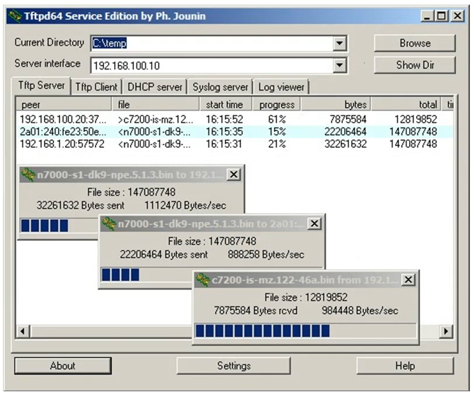
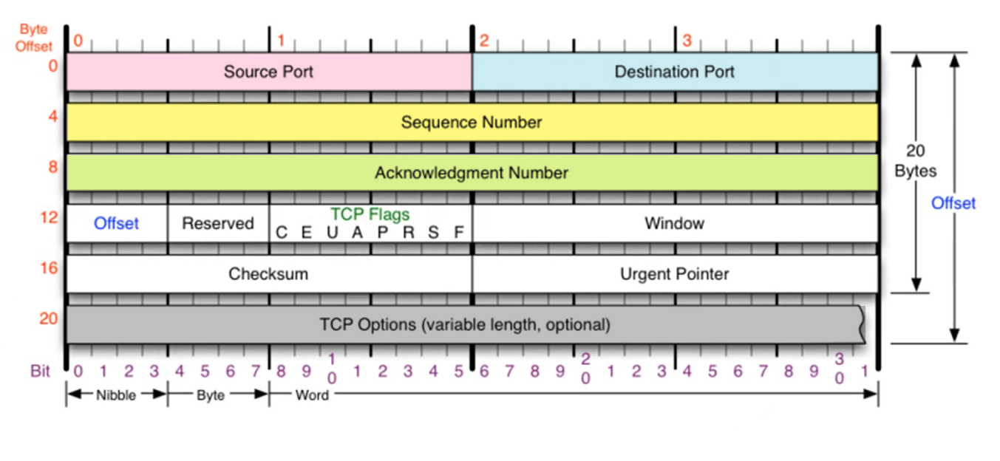
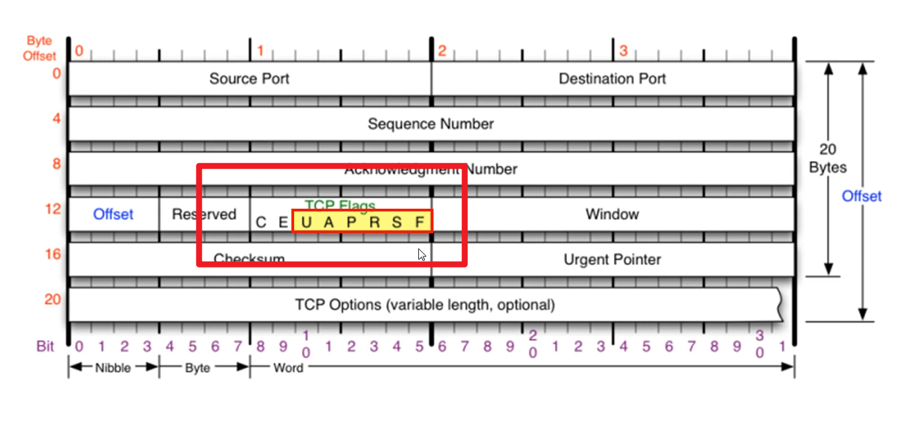

[TOC]

# TCP와 UDP는 왜 사용해야하는가?

1. IP(3계층)의 역할은 Host to Host(장치 to 장치)만 지원한다. 장치에서 장치로의 이동은 IP로 해결되지만, 하나의 장비 안에서 수많은 프로그램들이 통신을 할 경우에는 IP만으로는 한계가 있다.
2. 또한, IP에서 오류가 발생한다면 ICMP에서 알려주지만, ICMP는 알려주기만 할 뿐 대처를 못하기 때문에 IP보다 상위 계층에서 처리를 해야한다.
3. 프로그램간의 연결을 위해 포트 번호가 나오게 되었고, IP가 해결하지 못하는 부분을 해결하기 위해 TCP와 UDP가 필요하다.

#### TCP와 UDP가 어떻게 오류를 해결하는가?

- TCP : 데이터의 분실, 중복, 순서가 뒤바뀜 등을 자동으로 보정해서 데이터의 정확한 전달을 할 수 있도록 한다.
- UDP : IP가 제공하는 정도의 수준만을 제공해서 TCP와는 다르게 에러가 날 수도 있고, 재전송이나 순서가 뒤바뀔 수도 있다. 이 경우, 어플리케이션에서 처리하는 번거로움이 존재한다.

# ✂ 비연결지향형 UDP

## UDP(User Datagram Protocol) = 사용자 데이터그램 프로토콜

> 굉장히 단순한 방식을 사용한다.
>
> UDP의 결정적인 장점은 **데이터의 신속성**이다. 데이터의 처리가 TCP보다 빠르다.
>
> 데이터그램 단위로 쪼개면서 **전송**을 해야하기 때문에 전송 계층이다.
>
> 주로 실시간 방송과 온라인 게임에서 사용된다. 네트워크 환경이 안 좋을때, 끊기는 현상을 생각하면 된다.
>
> Universal Datagram Protocol(유니버설 데이터그램 프로토콜)이라고 일컫기도 한다.
>

### UDP가 하는 일

- 전송방식이 **너무 단순**해서 **서비스의 신뢰성이 낮고**, 데이터그램의 도착 순서가 바뀌거나, 중복되거나, 심지어는 통보 없이 누락시키기도 한다.
- 일반적으로 **오류의 검사와 수정이 필요 없는** 프로그램에서 수행할 것으로 가정한다.

### UDP 프로토콜의 구조 (간.단)

- 출발지 **포트번호**, 도착지 **포트번호**
- 길이 = UDP 헤더 + payload
- Checksum = 중간에 프로토콜이 잘 못 된게 있나 없나본다.

 

## UDP 프로토콜을 사용하는 프로그램

4계층은 프로그램과 프로그램간의 연결

### 1. DNS 서버 (Domain Name System)

- 도메인을 물으면 IP 주소를 알려주는데, 알려줄 때 **UDP**를 사용한다.

- DNS는 신뢰성이 있어야할 것 같은데 왜 UDP를 사용할까?

  1. DNS는 사실 `TCP` 랑 `UDP`를 둘 다 사용한다. 상황에 따라 다른 프로토콜을 사용하는 것.

  1. 보통은 UDP 패킷이 작기 때문에 작은 정보를 교환할 때 사용할 수 있기 때문에, 도메인에 맞는 IP주소라는 간단한 정보는 UDP 안에 들어갈 수 있는 크기이다.

  1. 하지만 데이터의 크기가 512 byte가 넘어가거나 응답을 받지 못한 경우 TCP를 사용한다고 한다.

참고 : https://docs.microsoft.com/ko-kr/troubleshoot/windows-server/networking/dns-works-on-tcp-and-udp

참고 : https://kin.naver.com/qna/detail.naver?d1id=1&dirId=10302&docId=415248256&qb=RE5TIFVEUA==&enc=utf8&section=kin.ext&rank=1&search_sort=0&spq=0

 

### tftpd (파일전송)	

- 파일전송을 UDP로 하면 중간에 깨질 수도 있으니까 안좋을 수도 있지 않을까? 라고 생각할 수 있다.

  - 큰 파일은 UDP로 전송하지 않는다. (앞서 512 byte가 넘으면 TCP로 전송해야한다고 한 것 처럼)

- UDP로 파일 전송하는건 특수한 경우인데, 동영상 스트리밍 할 때가 있다.

  - 동영상은 1초에 30개의 이미지가 있는건데 그 중 1장 빠져도 알아보기 어렵다.

  - 무조건 동영상 스트리밍 할 때 UDP를 쓴다는건 아니지만, 용도에 맞게 신뢰성이 없는 UDP도 사용하는 경우가 있다.

- 운영체제가 없는 컴퓨터에 운영체제를 전송할 때

  - 컴퓨터 100대에 OS를 한번에 보낼 때 일일이 하나하나 설치하기 힘드니까 서버 하나 설치해두고 랜선만 연결되어있으면 OS 파일을 전송해서 OS 설치.

- UDP와 TCP는 각각의 장단점이 있는 것이다.

  

# 🔗 연결지향형 TCP(Transmission Control Protocol) = 전송 제어 프로토콜

## TCP 프로토콜

> 인터넷 통신을 할 땐 주로 이더넷, IPv4, TCP를 사용한다.

### TCP가 하는 일

- 인터넷에 연결된 컴퓨터에서 실행되는 프로그램 간의 통신을 **안정적으로, 순서대로, 에러없이** 교환할 수 있게 한다.
- TCP의 안정성을 필요로 하지 않는 어플리케이션의 경우 일반적으로 TCP 대신 UDP를 사용한다.
- TCP는 UDP보다 안전하지만 느리다. 하지만 이걸 사람이 체감할 수는 없다.

 

### TCP 구조

- 출발지 포트번호, 도착지 포트 번호
- `Sequence Number`, `Acknowledgement Number`는 3 way handshake할 때 사용함
- `Offset` = 헤더의 길이를 표시한다고 생각하면 편하다. IPv4에서도 헤더의 길이를 표현할 때 4로 나눠서 표현했던 것과 똑같다.
- Reserved = 예약되어서 사용하지 않는 부분
- Checksum = 확인용
- `Window` (Size)= TCP가 연결 지향형이므로 상대방과 데이터를 주고 받을 때 받는 쪽에서 얼만큼 데이터를 더 받을 수 있는지 알려줌 (남아있는 TCP 버퍼 공간...)
  - 데이터 보내도 되니?
  - 어 -> 하면 보낼 수 있다.
  - 데이터 잘 받았니?
  - 어 + **얼마만큼 더 보내도 된다 **(이만큼 보내면 안전하게 잘 받을 수 있을 것 같아.) 라는 표현
- TCP options -> IPv4에도 있던 내용인데, 있을 수도 있고 없을 수도 있다. 일반적으론 잘 안붙는다. 일반적인 길이는 20 byte이지만 최대 60 byte까지 늘어날 수 있다.

 

## :star:TCP 플래그

### TCP 플래그의 종류

- TCP가 통신을 할 때 상대방과 연결상태를 물어보는데, **어떤 상황**인지 알려줄 수 있는 플래그.
  - 연결을 하려고 물어보는건지, 데이터를 보내도 된다고 대답하는건지, 연결을 종료하려는건지, 연결을 초기화하려는건지, 데이터를 보내는건지, 급한 데이터를 보내려는건지 알려준다.
- TCP의 주된 기능이 Flag에 따라 나뉘어진다.

### 각 플래그의 기능

- :star:U (`Urgent`) = 긴급 비트. 내가 지금 보내려는 데이터가 우선순위가 높다.
- :star:A (`Acknowledgment`) = 승인 비트. 굉장히 중요하고 많이 사용된다. 요청에 대해 승인을 해줄 때 사용한다.
- P (`Push`) = 밀어넣기 비트. 받을 수 있는 남은 공간의 양과 상관없이 무조건 데이터를 받는다.
- :star:R (`Reset`) = 초기화 비트. 상대방과 연결이 되어있는 상태에서 추가적으로 데이터를 주고받을 때 문제가 발생한 경우, 연결 상태를 초기화 할 때 사용한다.
- :star::star::star:S (`Syn`) = 동기화 비트. 상대방과 연결을 시작할 때 **무조건** 사용하는 플래그로서, 처음 보내지고 난 다음 부터 둘 사이의 연결이 동기화되기 시작한다. 서로 상태를 계속 주고받으면서 서로 상태를 계속 동기화 시킨다.
- F(`Fin`) = 종료비트. 연결을 끊을 때 사용한다.

> 다음주는 TCP 3Way Handshake를 하겠습니다.