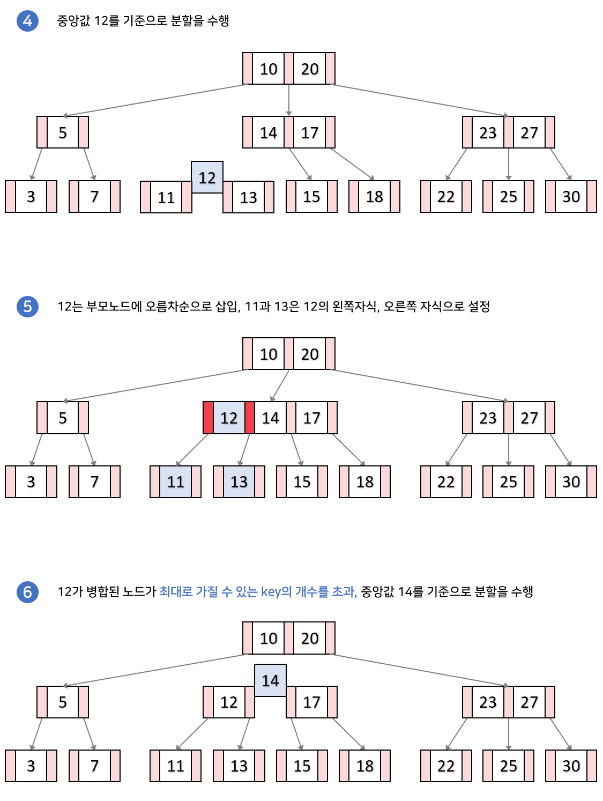
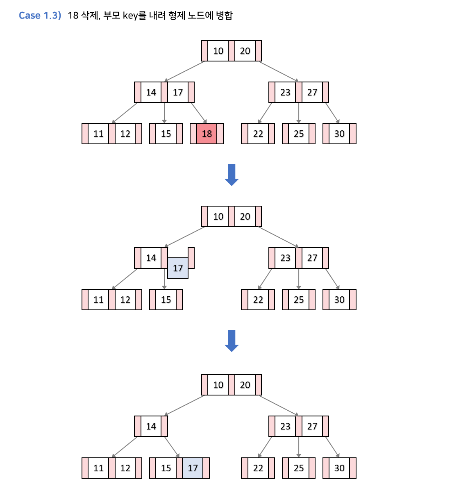
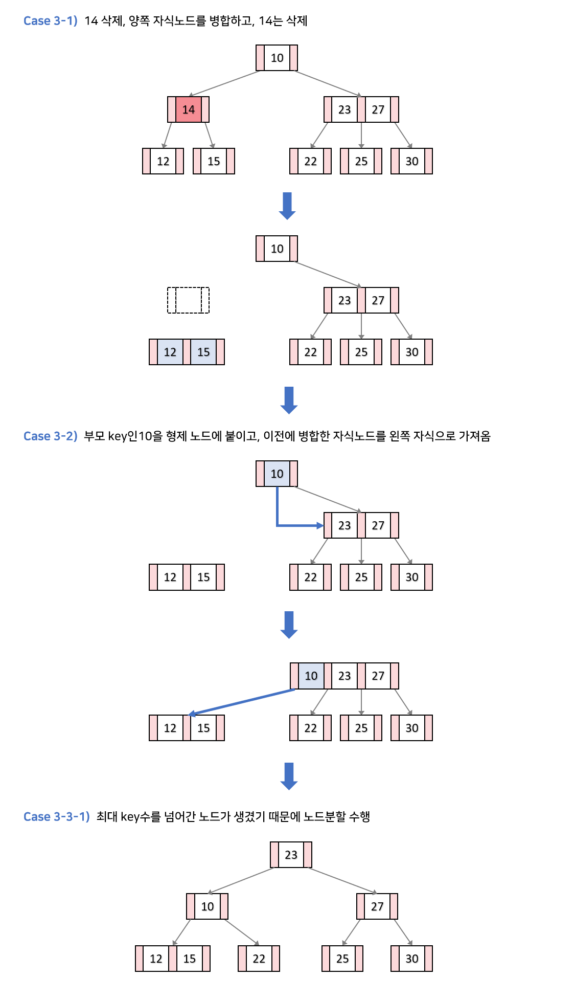
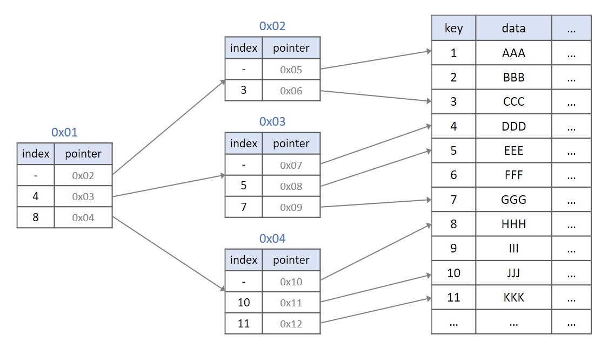

# 7. B Tree

## B\-Tree

> B Tree 란 이진트리에서 발전되어 **모든 리프노드들이 같은 레벨을 가질 수 있도록** 자동으로 밸런스를 맞추는 트리

### 특징

- 정렬된 순서를 보장
- 멀티레벨 인덱싱을 통한 빠른 검색
- 이진 트리와 다르게 하나의 노드에 많은 수의 정보를 가지고 있을 수 있음
- 트리의 균형을 맞춰주는 것이 핵심

### 용어

- key (=자료)
  - 노드 안에서 항상 정렬된 값ㅇ을 가짐
  - 각 key들의 왼쪽 자식들은 항상 key보다 작은 값, 오른쪽 자식들은 항상 key보다 큰 값을 가짐

- M차 B트리: 최대 `M`개의 자식을 가질 수 있는 B 트리

  - 최대 `M`개부터 `M/2`개 까지의 자식을 가질 수 있음, 루트 노드는 적어도 2개 이상의 자식 노드를 가짐

  - 노드에는 최대 `M-1`개부터 `(M/2)-1`개의 키가 포함될 수 있음

  - 노드의 키가 `x`개라면 자식의 수는 `x+1`개

  - 최소차수는 자식수의 하한값을 의미, 최소차수가 `t`라면 `M=2t-1`

> 예시) 3차 B Tree
>
> 파란 부분은 각 노드의 key, 빨간 부분은 자식 노드들을 가리키는 포인터

### 용도

- DB, 파일 시스템에서 자주 사용

### 검색 과정

루트노드에서 시작하여 하향식으로 검색을 수행

1. 검색하고자 하는 key를 `k`라 했을 때, 루트 노드에서 시작하여 key들을 순회하면서 검사
   - 만약 `k`와 같은 key를 찾으면 검색을 종료
   - 검색하는 값과 key들의 대소관계를 비교, 어떠한 key들 사이에 `k`가 들어간다면 해당 key들 사이의 자식노드로 내려감
2. 1번 과정을 리프노드에 도달할 때까지 반복, 만약 리프노드에도 `k`와 같은 key가 없다면 검색 실패

### 삽입 과정

리프노드에서 상향식으로 이루어짐

1. 요소 삽입에 적절한 리프 노드 검색
2. 필요한 경우 노드를 분할

**분할이 일어나지 않는 경우**

> 리프노드가 가득 차지 않았다면, 오름차순으로 `k`를 삽입

**분할이 일어나는 경우**

> 리프노드에 key 노드가 가득 찬 경우, 노드를 분할

1. 오름차순으로 요소를 삽입, 노드가 담을 수 있는 최대 key 개수 초과
2. 중앙값에서 분할 수행
   - 중앙값은 부모 노드로 병합하거나 새로 생성
   - 왼쪽 키들은 왼쪽 자식으로, 오른쪽 키들은 오른쪽 자식으로 분할
3. 부모 노드를 검사해서 또 다시 가득 찼다면, 위 과정 반복

### 삭제 과정

1. 삭제할 키가 있는 노드 검색
2. 키 삭제
3. 필요한 경우, 트리 균형 조정

> inorder predecssor: 노드의 왼쪽 자식에서 가장 큰 key
>
> inorder successor: 노드의 오른쪽 자식에서 가작 작은 key
>
> 부모 key : 부모 노드의 key들 중 가장 왼쪽 key, 본인 노드를 가지고 있는 key 값. 단 마지막 자식 노드의 경우 부모의 마지막 key

**삭제할 key `k`가 리프에 있는 경우**

> 현재 노드의 key 개수가 최소 key 개수보다 크다면 해당 `k`를 단순 삭제

> 현재 노드의 key 개수가 최소 key 개수보다 작고, 왼쪽 또는 오른쪽 형제 노드의 key가 최소 key 개수 이상이라면 부모 key 값으로 `k`를 대체
>
> 최소키 개수 이상의 키를 가진 형제 노드가 왼쪽 형제라면 가장 큰 값을, 오른쪽 형제라면 가장 작은 값을 부모 key로 대체

> 왼쪽, 오른쪽 형제 노드의 key가 최소 key 개수이고, 부모 노드의 key가 최소 개수 이상이면 `k`를 삭제한 후, 부모 key를 형제 노드와 병합
>
> 부모 노드의 key 개수를 하나 줄이고, 자식 수 역시 하나 줄여 B Tree 유지

> 자신과 형제, 부모 노드의 key 개수가 모두 최소 key 개수라면 부모 노드를 루트노드로 한 부분 트르이 높이가 줄어드는 경우이므로 재구조화 일어남

**삭제할 key `k`가 내부 노드에 있고, 노드나 자식에 키가 최소 키 개수보다 많을 경우**

1. 현재 노드의 inorder predecssor 또는 inorder successor와 `k`의 자리를 바꿈
2. 리프 노드의 `k`를 삭제하게 되면, 리프노드가 삭제되었을 때의 조건으로 변함

**삭제할 key `k`가 내부 노드에 있고, 노드에 key 개수가 최소 key 개수만큼, 노드의 자식 key 개수도 모두 최소 key 개수인 경우**

>  `k`를 삭제하면 트리의 높이가 줄어들어 재구조화가 일어나는 케이스

1. `k`를 삭제하고, `k`의 양쪽 자식을 병합하여 하나의 노드로 만듬
2. `k`의 부모 key를 인접한 형제 노드에 붙임, 이후, 이전에 병합했던 노드를 자식 노드로 설정
   - 새로 구성된 인접 형제 노드의 key가 최대 key 개수를 넘어갔다면, 삽입 연산의 노드 분할 과정을 수행
   - 인접 형제 노드가 새로 구성되더라도 원래 `k`의 부모 노드가 최소 key 개수보다 작아진다면, 부모 노드에 대하여 2번 과정부터 다시 수행

 

## B\+Tree

> 데이터의 빠른 접근을 위한 **인덱스 역할만 하는 비단말 노드**가 추가로 있음

### 특징

- 굉장히 작은 시간복잡도에 검색 수행

- M차 B\+트리: 최대 `M`개의 자식을 가질 수 있는 B 트리

  - 최대 `M`개부터 `M/2`개 까지의 자식을 가질 수 있음

  - 노드에는 최대 `M-1`개부터 `(M/2)-1`개의 키가 포함될 수 있음

  - 노드의 키가 `x`개라면 자식의 수는 `x+1`개

  - 최소차수는 자식수의 하한값을 의미, 최소차수가 `t`라면 `M=2t-1`

### 용도

- 실제 DB의 인덱싱

### B 트리와 B\+Tree 의 차이점

1. 모든 key, data가 리프 노드에 모여 있음
   - B Tree는 리프 노드가 아닌 각자의 key 마다 data를 가짐
   - B\+Tree는 리프 노드에 모든 data를 가짐
   - B 트리에 비해 단점이 될 수 있음
2. 모든 리프 노드가 연결리스트의 형태를 띄고 있음
   - B Tree는 옆에 있는 리프 노드를 검사할 때, 다시 루트 노드부터 검사해야 함
   - B\+Tree는 리프 노드에서 선형 검사를 수행할 수 있어 시간복잡도가 굉장히 줄어듬
3. 리프 노드의 부모 key는 리프 노드의 첫 번째 key보다 작거나 같음

### 검색 과정

> B Tree의 검색 과정과 동일

### 삽입 과정

> 분할이 일어나지 않고, 삽입 위치가 리프노드의 가장 앞 key 자리가 아닌 경우 B Tree 삽입 과정과 동일

> 분할이 일어나지 않고, 삽입 위치가 리프노드의 가장 앞 key 자리인 경우 삽입 후 부모 key를 삽입된 key로 갱신하고, data를 넣어줌

> 분할이 일어나는 삽입과정인 경우, 중간 key를 부모 key로 올리지만, 오른쪽 노드에 중간 key를 포함하여 분할
>
> 리프 노드는 연결리스트이기 때문에 왼쪽 자식 노드와 오른쪽 자식 노드를 이어줘 연결 리스트 형태를 유지

### 삭제 과정

> 삭제할 key `k`가 index에 없고, 리프 노드의 가장 처음 key가 `k`가 아닌 경우 기존 B Tree 삭제 과정과 동일

> 삭제할 key `k`가 리프노드의 가장 처음 key인 경우 항상 `k`가 index 내에 존재

1. B Tree 의 삭제과정과 동일하게 수행. 단, 리프노드가 병할할 때는 부모 key와 오른쪽 자식의 처음 key가 동일하기 때문에 부모 key를 가져오는 과정만 생략하고 왼쪽 자식과 오른쪽 자식을 병합
2. 리프 노드의 `k`를 삭제한 후, idnex내의 `k`를 inorder successor로 변경

 

> 출처
>
> [[자료구조\] 그림으로 알아보는 B-Tree - velog](https://velog.io/@emplam27/자료구조-그림으로-알아보는-B-Tree)