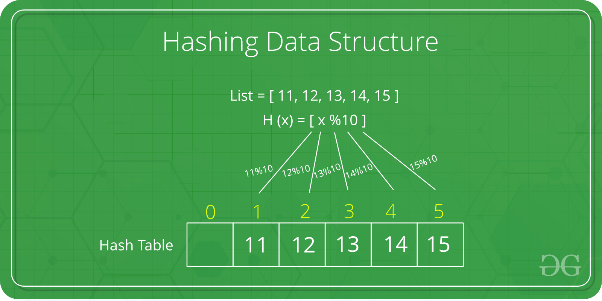
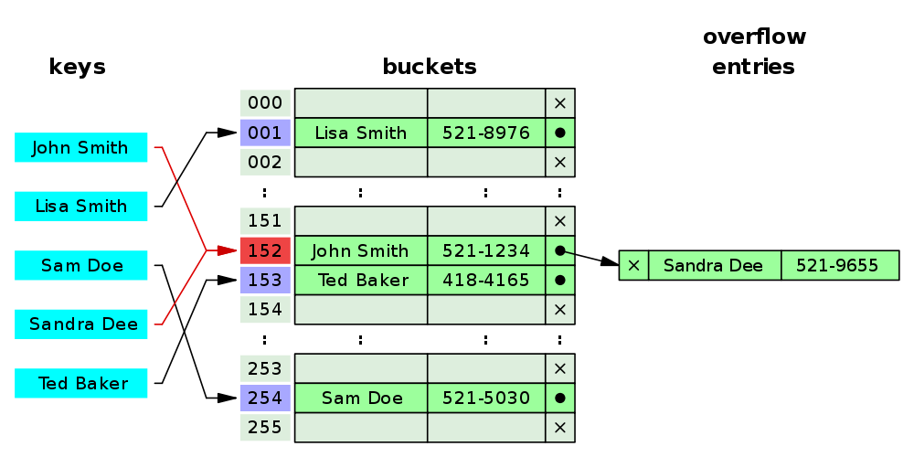
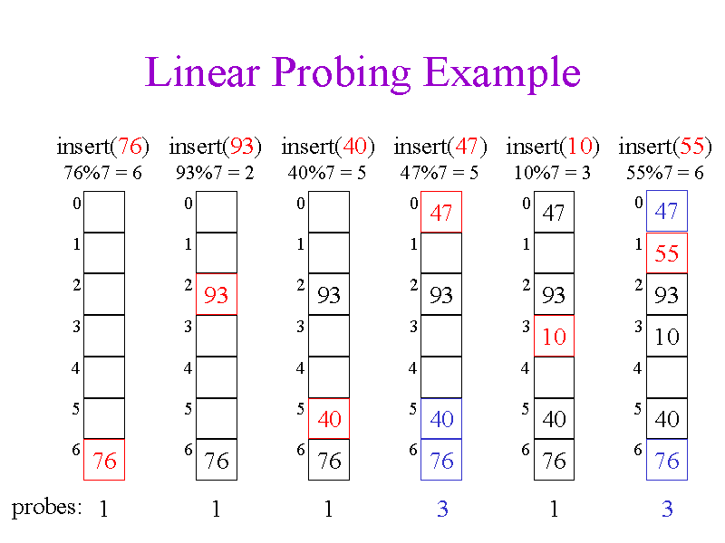
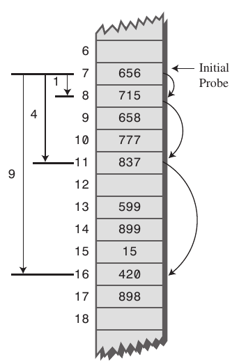

# 7. Hash

## Hash 용어

**해시 함수**: 임의의 길이의 데이터를 고정된 길의의 데이터로 매핑하는 **단방향 함수**

- ex. 아무리 큰 숫자를 넣어도 10으로 나누었을 때 나머지는 0 ~ 9 이다.
- 하나의 주어진 출력에 대하여 이 출력으로 사상시키는 하나의 입력을 찾는 것이 불가능
- 하나의 주어진 입력에 대하여 같은 출력으로 사상시키는 또 다른 입력을 찾는 것이 불가능

**해싱**: 인코딩, 암호화, 해시 함수를 적용

**해시값**: 해시 함수를 적용하여 나온 고정된 길이의 값

- 해시코드, 해시섬, 체크섬, **해시** 등으로 불림

**해시 알고리즘**: 해시값을 생성하는 알고리즘(해시 함수를 구현하는 방법)

- Message\-Digest Algorithm(MD)
  - MDn \- **MD5**
- Secure Hash Algorithm(SHA)
  - SHA\-n \- SHA\-1, **SHA\-2(SHA\-256, SHA\-512)**, SHA\-3

 

## Hash

**특징**

- 데이터를 다루는 기법 중 하나
- 같은 입력값에 대해서 같은 출력값이 보장
  - 출력값은 가능한 한 고른 범위에 균일하게 분포
  - 다른 입력값에 같은 출력값이 출력되는 경우가 존재 - **충돌**
- 입력값이 조금만 달라져도 출력값이 크게 달라짐 - 눈사태 효과

**용도**

- **해시 테이블**
- 매우 빠른 데이터 검색(컴퓨터 소프트웨어)
  - 데이터를 검색할 때, 사용할 `key`와 실제 데이터 값 `value`가 한 쌍으로 존재
  - `key` 값이 배열의 인덱스로 변환
  - 검색과 저장의 평균적인 시간복잡도가 `O(1)`
- 암호학
- 데이터 무결성 검증

 

## 해시 테이블

> 해시 함수를 사용하여 `key`를 해시값으로 매핑하고, 이 해시값을 주소 또는 인덱스로 삼아 `value`를 `key`와 함께 저장하는 자료구조

[그림 출처](https://www.geeksforgeeks.org/hashing-data-structure/)

**구성**

- `key`
  - 고유한 값
  - 해시 함수의 입력값
- `value`
  - 해시 함수의 출력값
  - 저장소에 저장되는 값
  - 해시와 매칭되어 있음
- 해시 함수
  - `key`를 고정된 길이의 해시로 변경해주는 역할

**장점**

- 삽입, 삭제, 검색 과정에서 모두 평균적으로 `O(1)`의 시간복잡도를 가짐

**단점**

- **해시 충돌** 발생
  - Chaining(분리 체인법)
  - 2차 탐사
  - 오픈 어드레싱
    - 선형 탐사
    - 제곱 탐사
    - 이중 해싱

- 순서/관계가 있는 배열에는 어울리지 않음
- 공간 효율성이 떨어짐
  - 데이터가 저장되기 전에 저장공간을 미리 만들어놔야 함
  - 공간을 만들어놨지만 공간이 채워지지 않는 경우 발생
- 해시 함수의 의존도가 높음
  - 해시 함수가 복잡하다면 해시를 만들어내는데 오래 걸릴 수 있음

**적재율**

> 해시 테이블의 크기 대비 키의 개수

- 키의 개수를 `K`, 해시 테이블의 크기를 `N`
- `적재율  = K / N`
- Direct Address Table: 충돌이 일어나지 않는 테이블
  - 적재율이 1 이하
  - 검색, 삽입, 삭제 연산에 `O(1)`
- 적재율이 1 초과인 경우, 충돌이 일어남 \- 비둘기 집의 원리
  - 검색, 삽입, 삭제 연산에 최악의 경우 `O(K)` = 같은 인덱스에 모든 키 값과 데이터가 저장된 경우
  - 충돌이 적게 나는 해시 알고리즘을 사용하여 연산속도를 빠르게 하는 것이 중요

 

## 충돌

**충돌을 완화하는 방법**

- 해시 테이블의 구조 개선
- 해시 함수 개선

**해시 테이블의 구조 개선**

- Chaining(분리 체인법): 충돌이 발생했을 때 이를 동일한 버킷에 저장하는데 이를 연결리스트 형태로 저장

  - 

    [그림 출처](https://en.wikipedia.org/wiki/Hash_table#Separate_chaining)

  - 삽입의 경우 연결리스트에 추가하기만 하면 되므로 `O(1)`

  - 검색과 삭제의 경우 최악일 때 `O(K)`, 평균적으로 `O(K/N)`(적재율)

  - 장점: 미리 충돌을 대비해서 공간을 마련할 필요 없음

  - 단점: 같은 해시에 자료들이 많이 연결되면 검색 효율 낮아짐

- Open Addressing: 동일한 주소에 다른 데이터가 있을 경우 다른 주소도 이용할 수 있게 하는 기법

  - 

    [그림 출처](https://en.wikipedia.org/wiki/Hash_table#Open_addressing)

  - 삽입

    - 계산한 해시 값에 대한 인덱스가 이미 차있는 경우, 다음 인덱스로 이동하면서 비어있는 곳에 저장
    - 비어있는 자리릍 탐색하는 것을 **탐사(Probing)**라고 함

  - 탐색

    - 계산한 해시 값에 대한 인덱스부터 검사하며 탐사를 해나가는데 삭제 표시가 있는 부분은 지나감

  - 삭제

    - 탐색을 통해 해당 값을 찾고 삭제한 뒤 삭제 표시를 함

  - 충돌 처리

    |                          선형 탐사                           |                          제곱 탐사                           |                          이중 해싱                           |
    | :----------------------------------------------------------: | :----------------------------------------------------------: | :----------------------------------------------------------: |
    |  [그림 출처](https://courses.cs.washington.edu/courses/cse326/00wi/handouts/lecture16/sld015.htm) |  [그림 출처](https://stackoverflow.com/questions/27742285/what-is-primary-and-secondary-clustering-in-hash) |  [그림 출처](http://www.cs.uml.edu/~tom/404/notes/Hashing.pdf) 적재율이 a(알파)인 그래프 Unsuccessful은 찾고자 하는 데이터가 해시테이블에 없는 경우 |
    |               위에서 설명한 기본적인 동작 방식               |  `1^2`, `2^2`, `3^2`, .... 방식으로 인덱스를 탐사하는 방식   | 처음 해시함수로는 해시값을 찾기 위해 사용 두번째 해시함수는 충돌이 발생했을 때 탐사폭을 계산하기 위해 사용 |
    | 바로 인접한 인덱스에 데이터를 삽입해가기 때문에 데이터가 밀집되는 클러스터링 문제 발생 | 선형탐사에 비해 더 폭넓게 탐사하기 때문에 검색과 삭제에 효율적일 수 있음, but 초기 해시값이 같을 경우 클러스터링 문제 발생 |              클러스터링 문제를 피하기 위해 도입              |

**해시 함수 개선**

- Division Method(나눗셈법): 해시 함수를 적용하고자 하는 값을 `N`으로 나눈 나머지를 해시값으로 사용하는 방법
  - 미리 해시 테이블의 크기인 `N`을 아는 경우에 사용 가능
  - `h(K) = K mod N`
  - `N`은 2의 제곱수를 사용하면 안됨
    - 제곱꼴이 `2^p`로 나타날 때, `K`의 하위 `p`개의 비트를 고려하지 않음
    - 따라서 `N`은 2의 제곱수와 먼 소수를 사용하는 것이 좋음 \- 해시의 중복을 방지
    - 즉, 해시 테이블의 크기가 정해짐
- Multiplication Method(곱셈법)
  - `0 < a < 1`인 `a`에 대하여 `h(K) = ((K * a) mod 1) * N`
  - `(K * a) mod 1`은 `K * a`의 소수점 이하 부분을 의미
  - 이를 `N`에 곱하므로 0부터 `N`사이의 값이 됨
  - `N`이 어떤 값이더라도 잘 동작
  - `a`를 잘 잡는 것이 중요
  - 2진수 연산에 최적화도니 컴퓨터 구조를 고려한 해시 함수
- Universal Hashing
  - 여러 개의 해시 함수를 만들고 이 해시 함수의 집합 `H`에서 무작위로 해시 함수를 선택해 해시값을 만드는 기법
  - 서로 다른 해시 함수가 서로 다른 해시값을 만들어내기 때문에 같은 공간에 매핑할 확률을 줄임

 

> 출처
>
> [해시 함수 - 위키백과, 우리 모두의 백과사전](https://ko.wikipedia.org/wiki/해시_함수)
>
> [해시(Hash)란 무엇인가? - siyoon210 - 티스토리](https://siyoon210.tistory.com/85)
>
> [[DS\] 해쉬 테이블(Hash Table)이란? - 배하람의 블로그](https://baeharam.netlify.app/posts/data structure/hash-table/)