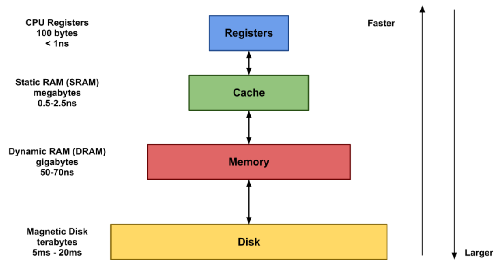

# 컴퓨터의 구성

## 컴퓨터는 크게 하드웨어와 소프트웨어로 나뉜다.

- 하드웨어
  - **CPU**
  - **기억장치**
    - RAM
    - HDD / SSD
  - **입출력 장치**
- 소프트웨어
  - 시스템 소프트웨어
    - OS
    - Compiler
  - 응용 소프트웨어

## 하드웨어

서로 **시스템 버스**로 연결되어 있다.

### CPU

주기억장치에서 프로그램 명령어와 데이터를 읽어와 처리하고 명령어의 수행 순서를 제어함

- CPU 구성요소

  - 산술논리연산장치(ALU) : 비교와 연산을 담당

  - 제어장치 : 명령어의 해석과 실행을 담당

  - 레지스터 : 속도가 빠른 데이터 기억장소

    - 캐시와의 차이점은?

      

### 기억장치

프로그램, 데이터, 연산의 중간 결과를 저장하는 장치

- 기억장치의 분류
  - 주기억장치
    - RAM
  - 보조기억장치 - 주기억장치에 비해 속도는 느리지만 많은 자료를 영구적으로 보관 가능
    - ROM

### 입출력 장치

입력장치 + 출력장치

### 시스템 버스

하드웨어 구성 요소를 물리적으로 연결하는 선

각 구성요소가 다른 구성요소로 데이터를 보낼 수 있도록 통로가 되어 줌

- 용도에 따른 분류
  - 데이터 버스
    - CPU와 기타 장치 사이에서 테이터를 전달
    - 양방향 버스
  - 주소 버스
    - 데이터를 실어나르기 위한 주소를 전달
    - 단방향 (CPU → 주기억장치 / 입출력 장치)
  - 제어 버스
    - 데이터 버스와 주소 버스가 모든 장치에 공유되기 때문에 제어할 수단이 필요함
    - CPU가 기억장치나 입출력 장치에 제어 신호를 전달
    - 제어신호의 종류: 기억장치 읽기 / 쓰기 신호, IO 읽기 / 쓰기 신호 등등
    - 읽기와 쓰기 모두 수행하기 때문에 양방향

- 구성 요소간 통신
  1. CPU <-> 기억장치
     1. 적재(Load)
        - 주소 버스 : 메모리에서 불러올 데이터가 저장된 주소값이 전달(CPU -> Memory)
        - 신호 버스 : Memory Read 신호 전달(CPU -> Memory)
        - 데이터 버스 : 지정한 메모리에 저장된 값 전달(Memory -> CPU)
     2. 저장(Store)
        - 주소 버스 : 메모리에서 해당 데이터를 저장할 주소값 전달(CPU -> Memory)
        - 신호 버스 : Memory Write 신호 전달(CPU -> Memory)
        - 데이터 버스 : 저장할 데이터 전달(CPU -> Memory)
  2. CPU <-> I/O
     1. 입력(Input)
        - 주소 버스 : 해당 입출력 장치의 포트 번호 전달(CPU -> I/O Unit)
        - 신호 버스 : I/O Read(input) 신호 전달(CPU -> I/O Unit)
        - 데이터 버스 : 해당 입출력 장치는 데이터 전달(I/O Unit -> CPU)
     2. 출력(Output)
        - 주소 버스 : 해당 입출력 장치의 포트 번호 전달(CPU -> I/O Unit)
        - 신호 버스 : I/O Write(output) 신호 전달(CPU -> I/O Unit)
        - 데이터 버스 : 입출력 장치에 데이터 전달(CPU -> I/O Unit)
     3. 인터럽트(Inputerrupt)
        - 입출력장치는 제어신호를 통해 인터럽트 요청을 보내 CPU에 입출력작업을 요청할 수 있음
        - 인터럽트 요청 : 입출력 준비를 마친 I/O Unit이 CPU에 입출력작업의 시작 요청
        - 인터럽트 확인 : CPU가 입추력 동작을 수행할 것을 입출력장치에 통보
  3. 기억장치 <-> I/O
     - 입출력장치와 메모리의 통신은 CPU를 이용하지 않고 직접 기억장치 액세스 방식(DMA, Direct Memory Access)으로 통신
     - DMA 제어기는 CPU를 대신해 주소 버스와 제어버스에 신호를 전달
     - DMA 제어기는 통신 시작 전 CPU에 버스 사용해 대한 허가를 받아야함

### 컴퓨터는 기본적으로 READ → PROCESS → WRITE의 구조로 작동함

이 과정을 끊임없이 주 기억장치와 소통하며 진행.

이때 운영체제가 64bit 운영체제라면 한번에 읽어오는 데이터 크기가 64bit라는 의미